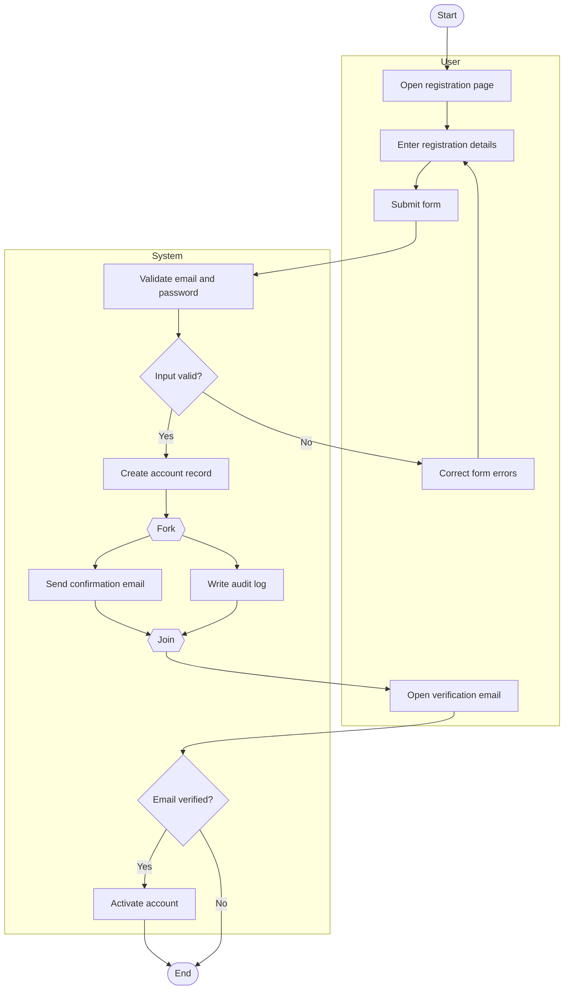
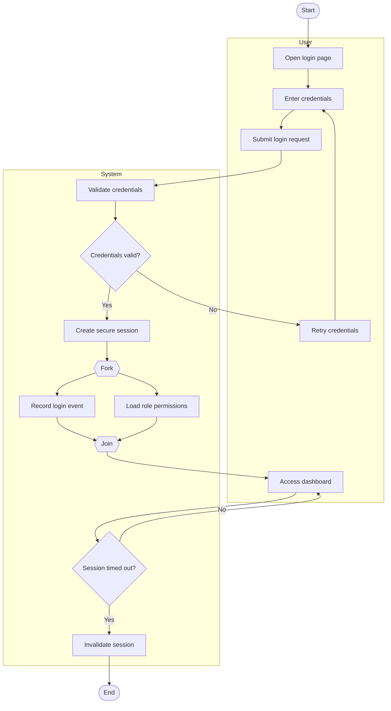
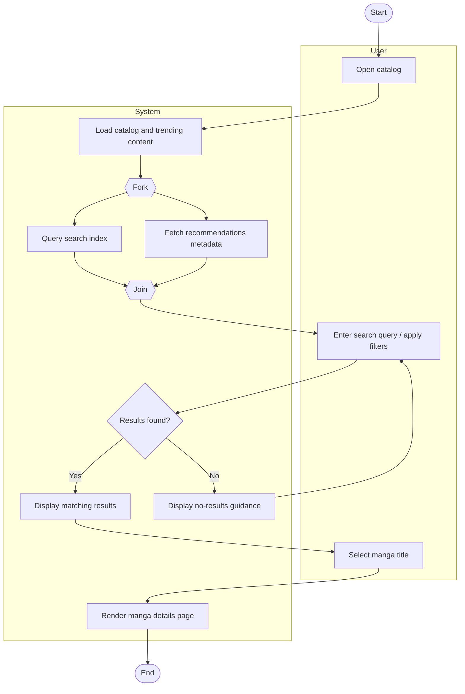
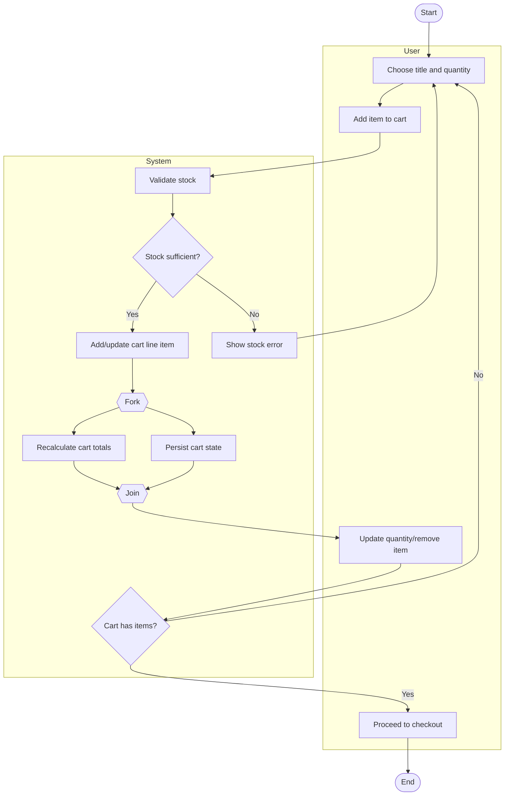
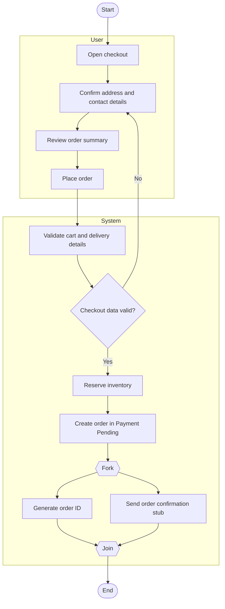
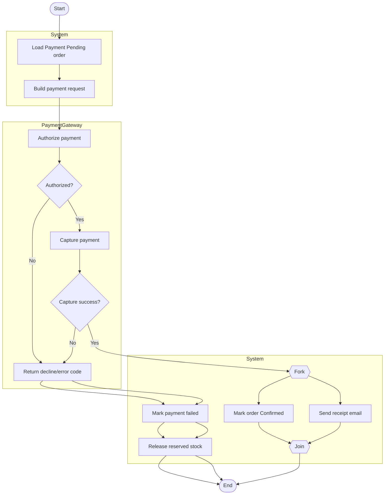
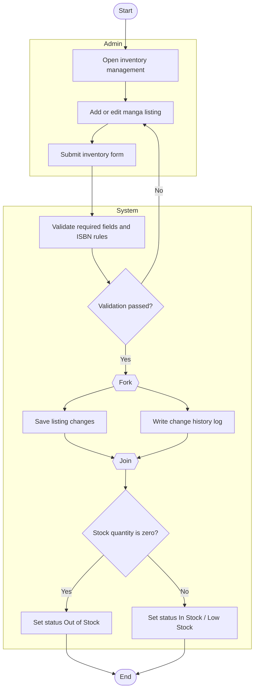
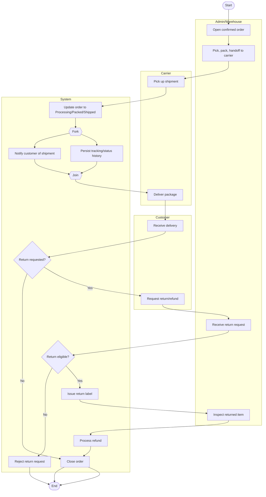

# Assignment 8 - UML Activity Diagrams (Mermaid)

This document contains **8 workflow activity diagrams** with swimlanes (actors), decisions, and parallel actions, plus short traceability notes.

---

## 1) User Registration

**Explanation:** Handles account creation, validation loops, and parallel confirmation/audit actions.  
**Traceability:** FR-1, FR-2; US-001; Assignment 6 tasks AP6-T07, AP6-T08.

---

## 2) User Login

**Explanation:** Models secure authentication, session initialization, and timeout behavior.  
**Traceability:** FR-2; US-002; Assignment 6: inferred from account/security work (not explicitly decomposed).

---

## 3) Browse/Search and View Book

**Explanation:** Captures discovery flow and high-performance search behavior with alternate no-result loop.  
**Traceability:** FR-3, FR-4, FR-5, FR-6; US-003, US-004, US-005, US-006; Assignment 6 tasks AP6-T01, AP6-T02, AP6-T03.

---

## 4) Add to Cart and Update Cart

**Explanation:** Ensures stock-safe cart updates with concurrent persistence and total recalculation.  
**Traceability:** FR-7, FR-8; US-007, US-008; Assignment 6 tasks AP6-T04, AP6-T05, AP6-T06.

---

## 5) Checkout and Place Order

**Explanation:** Separates order creation from gateway execution, leaving order in payment-pending state.  
**Traceability:** FR-9; US-009; Assignment 6: inferred from checkout scope (not explicitly decomposed).

---

## 6) Process Payment

**Explanation:** Isolates payment gateway lifecycle and order outcome updates for clarity and failure handling.  
**Traceability:** FR-9, FR-14; US-009, US-014; Assignment 6: inferred (not explicitly decomposed).

---

## 7) Admin Add/Update Book Inventory

**Explanation:** Supports controlled catalog maintenance with validation and audit logging.  
**Traceability:** FR-11, FR-12, FR-13; US-011, US-012, US-013; Assignment 6: admin work not explicitly scheduled.

---

## 8) Order Fulfillment/Shipping and Return/Refund

**Explanation:** Covers downstream logistics and post-delivery return/refund branch in one operational workflow.  
**Traceability:** FR-10, FR-14; US-010, US-014; Assignment 6: inferred (not explicitly decomposed).
