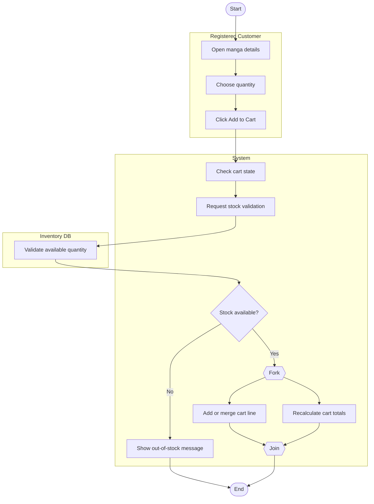

# Add to Cart + Validate Stock Workflow Activity Diagram

## Explanation
- **Stakeholder concerns:** Customers need immediate feedback; operations require preventing overselling.
- **Decisions/parallelism:** Stock decision ensures guardrails; cart-line update and total recalculation execute in parallel for speed.
- **Use case and placeholder mapping:** Add Items to Shopping Cart, Validate Stock Availability; FR-107, FR-118; US-204; ST-204.
