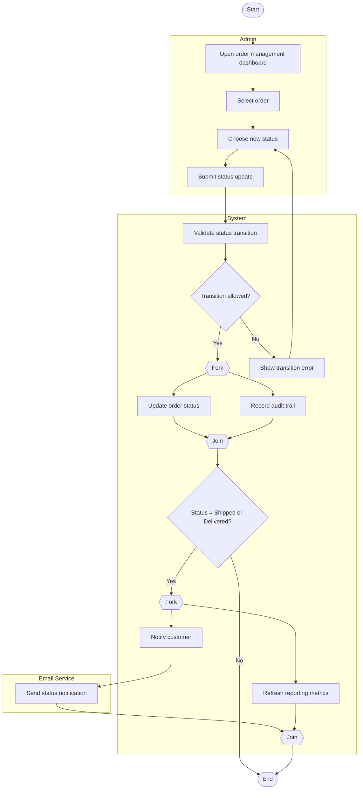

# Admin Update Order Status / Fulfillment Workflow Activity Diagram

## Explanation
- **Stakeholder concerns:** Admins need controlled transitions; customers need timely shipment updates; management needs updated operational metrics.
- **Decisions/parallelism:** Guarded transition check prevents invalid status changes; notification and metrics refresh execute in parallel after key fulfillment states.
- **Use case and placeholder mapping:** Update Order Status, View All Customer Orders, Track Order Status; FR-117, FR-121; US-208; ST-208.
