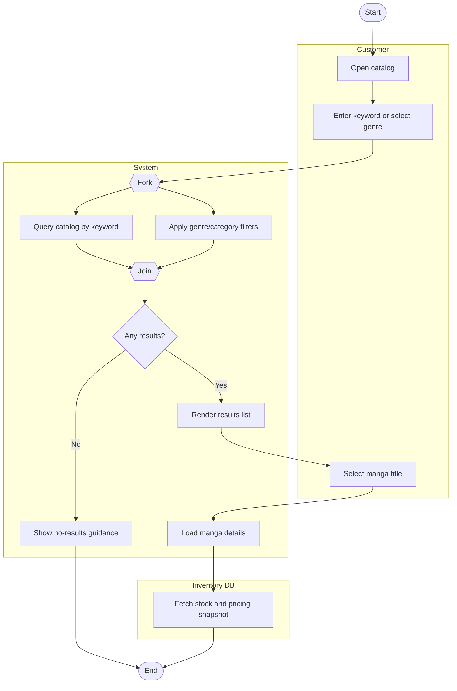

# Browse/Search/Filter/View Manga Workflow Activity Diagram

## Explanation
- **Stakeholder concerns:** Shoppers expect responsive discovery and accurate details before purchase.
- **Decisions/parallelism:** Search and filter processing run in parallel; decision branch handles empty results gracefully.
- **Use case and placeholder mapping:** Browse Manga Catalog, Search Manga by Title/Author/ISBN, Filter by Genre/Category, View Manga Details; FR-123, FR-124; US-203; ST-203.
