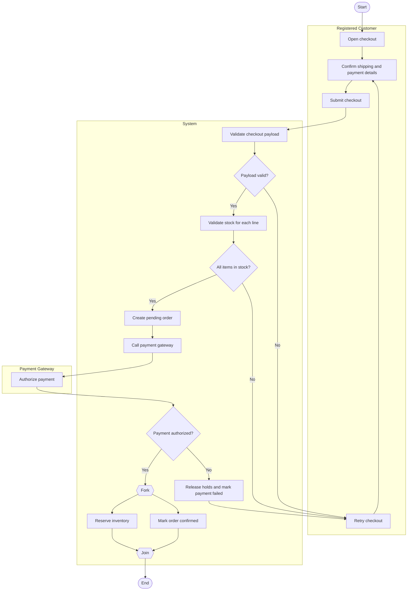

# Checkout Process Workflow Activity Diagram

## Explanation
- **Stakeholder concerns:** Customers need trustworthy checkout outcomes; finance/inventory teams require atomic confirmation behavior.
- **Decisions/parallelism:** Validation and payment decisions enforce correctness; confirmation and inventory reservation run in parallel to reduce latency.
- **Use case and placeholder mapping:** Checkout Process, Process Payment, Validate Stock Availability; FR-110, FR-113, FR-118; US-206; ST-206.
