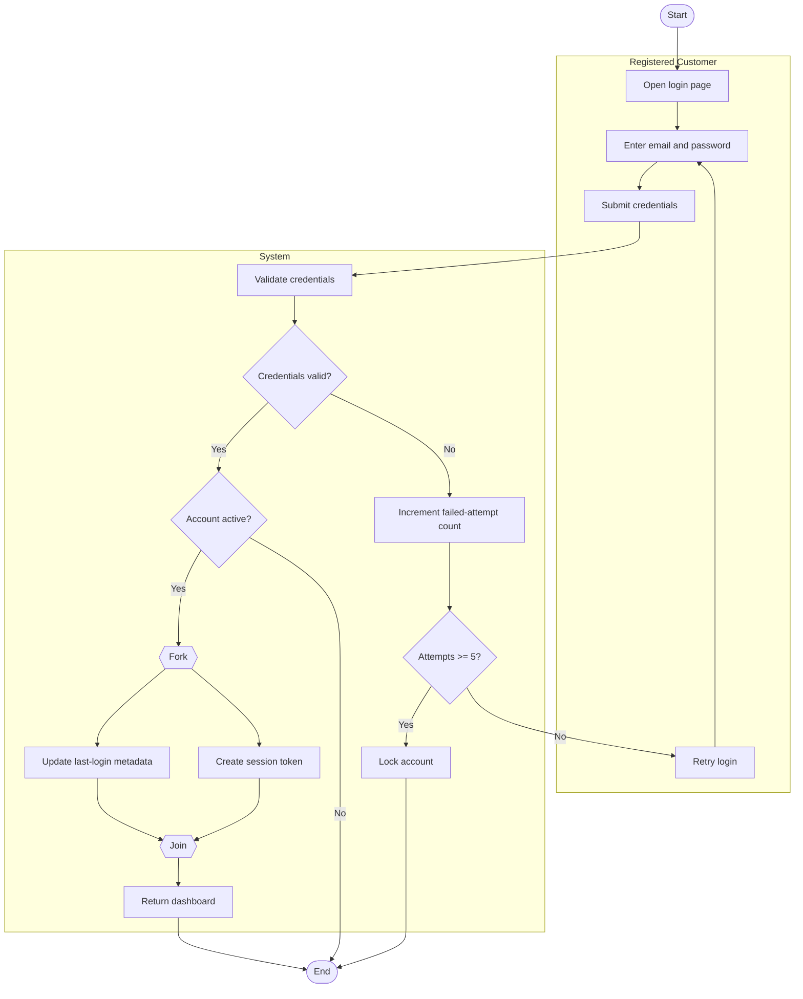

# Login and Authentication Workflow Activity Diagram

## Explanation
- **Stakeholder concerns:** Customers need quick login; security stakeholders need lockout controls and session integrity.
- **Decisions/parallelism:** Credential and account checks are decision points; token creation and audit updates run in parallel.
- **Use case and placeholder mapping:** Login/Authentication; FR-105, FR-106; US-202; ST-202.
