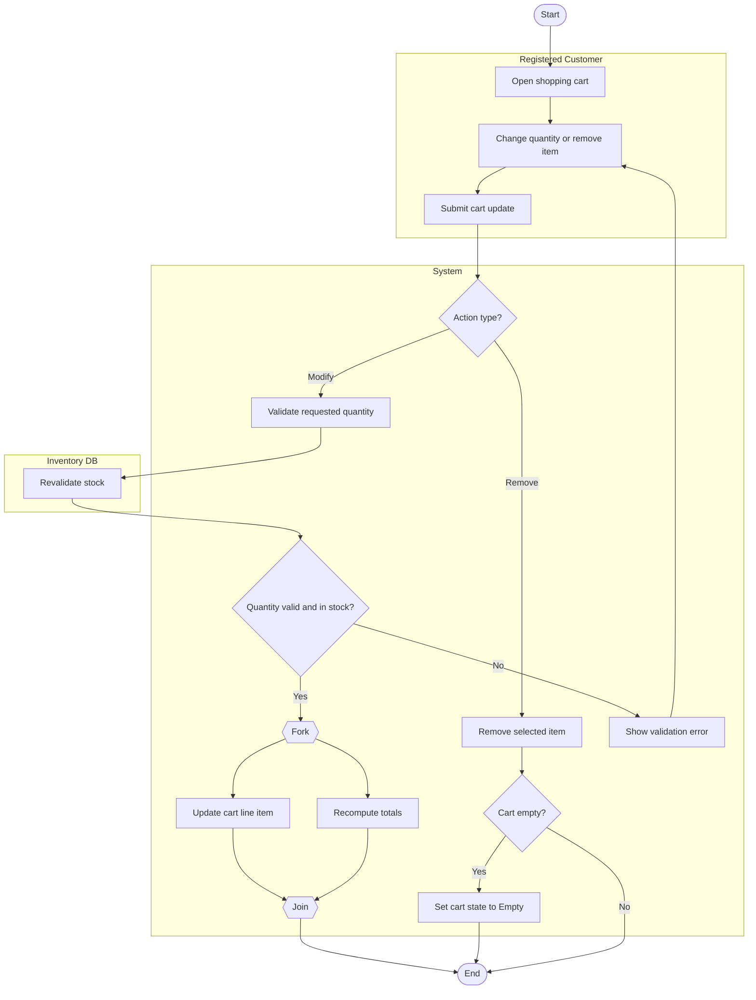

# Modify/Remove Cart Items Workflow Activity Diagram

## Explanation
- **Stakeholder concerns:** Cart edits must remain accurate while keeping customer friction low.
- **Decisions/parallelism:** Decision branches distinguish modify vs remove paths; update and total recomputation run concurrently.
- **Use case and placeholder mapping:** Modify Cart Quantity, Remove Items from Cart, Validate Stock Availability; FR-107, FR-108; US-205; ST-205.
