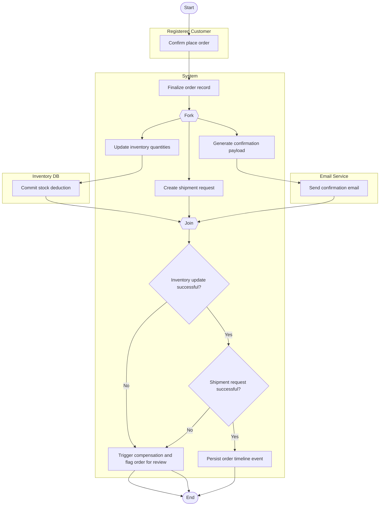

# Place Order Workflow Activity Diagram

## Explanation
- **Stakeholder concerns:** Customers need quick confirmations; operations need inventory/shipping updates without manual delay.
- **Decisions/parallelism:** Parallel post-order tasks (inventory update, shipment creation, and email) improve speed, while post-join decisions add consistency checks and compensation on failure.
- **Use case and placeholder mapping:** Place Order, Send Confirmation Email, Update Inventory; FR-111, FR-119; US-207; ST-207.
