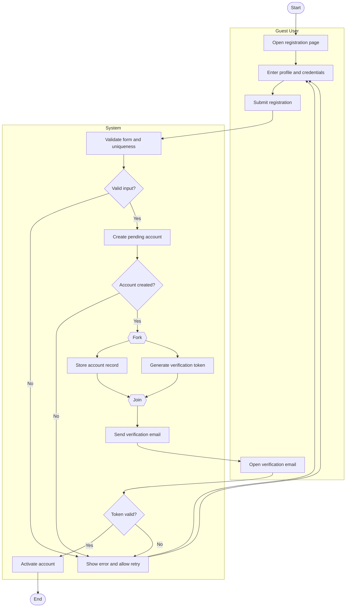

# User Registration Workflow Activity Diagram

## Explanation
- **Stakeholder concerns:** Users need reliable onboarding; admins need verified identities before account activation.
- **Decisions/parallelism:** Validation and token checks handle quality/security gates. Parallel account persistence + token generation reduces processing time, while email is sent only after account creation succeeds.
- **Use case and placeholder mapping:** Register Account, Login/Authentication; FR-104, FR-105; US-201; ST-201.
