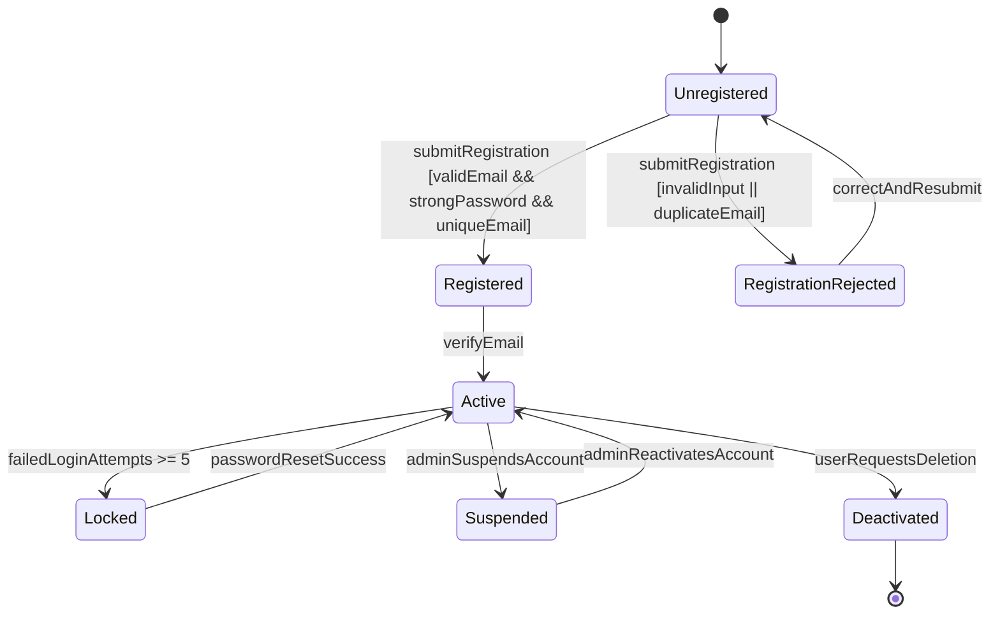
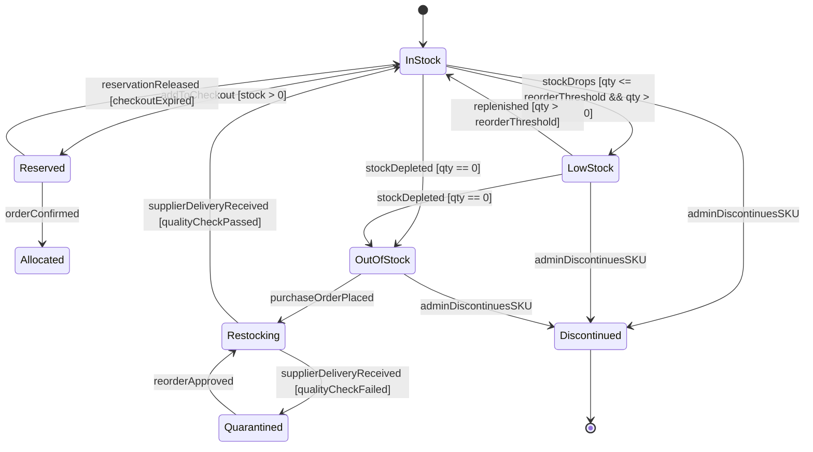
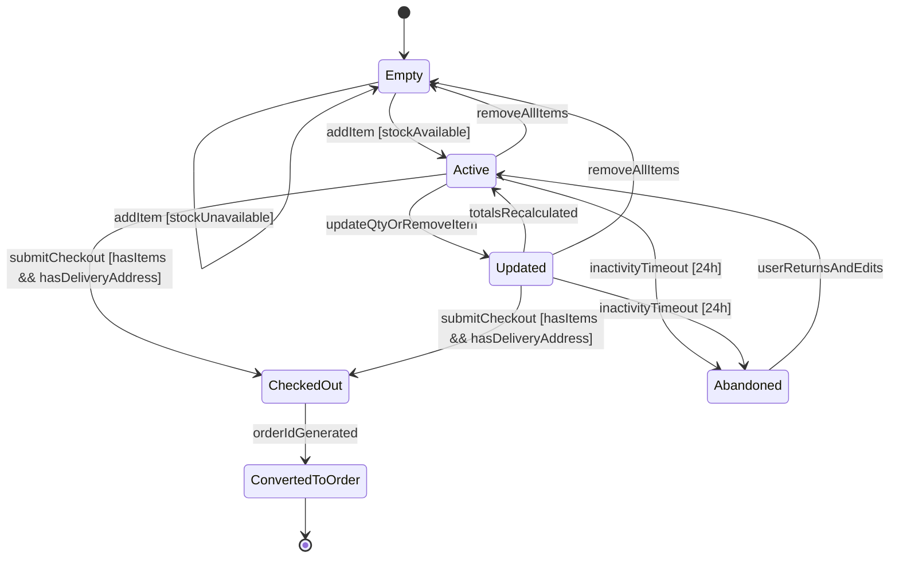
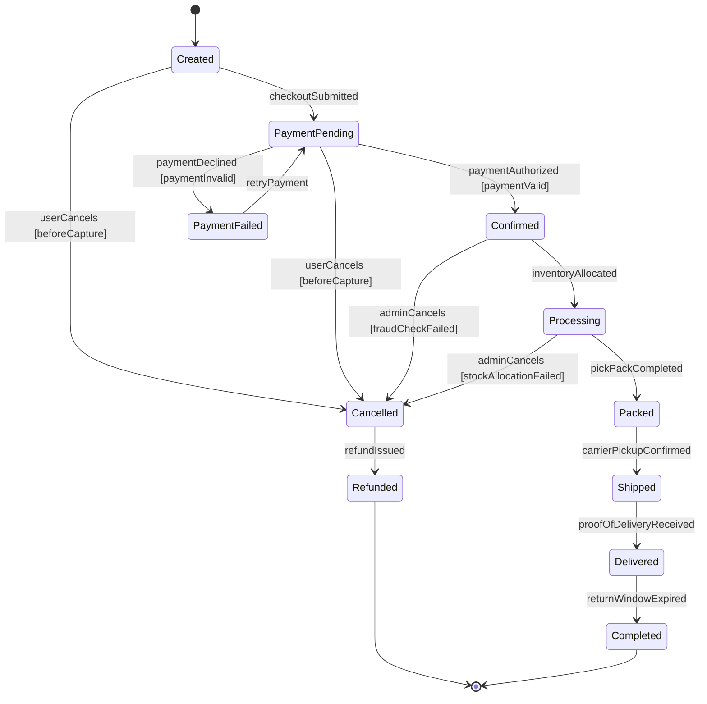
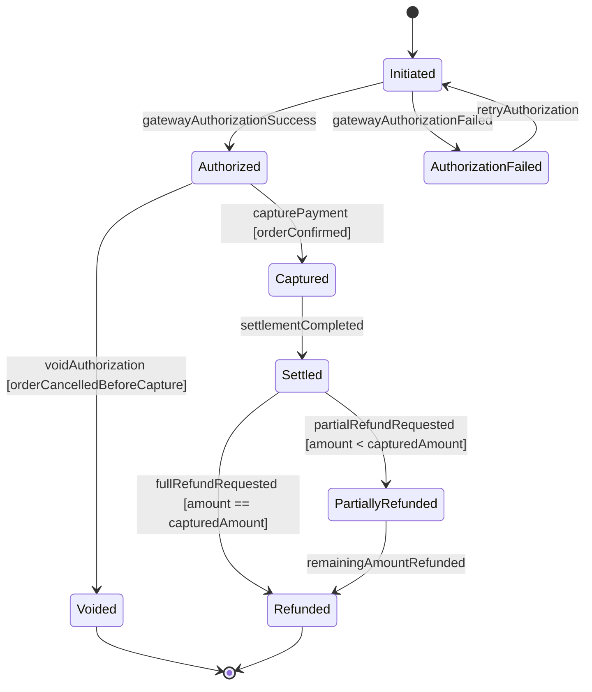
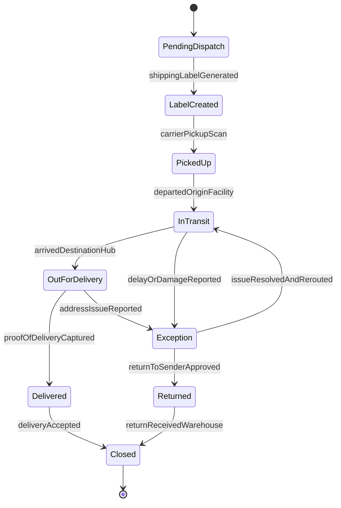
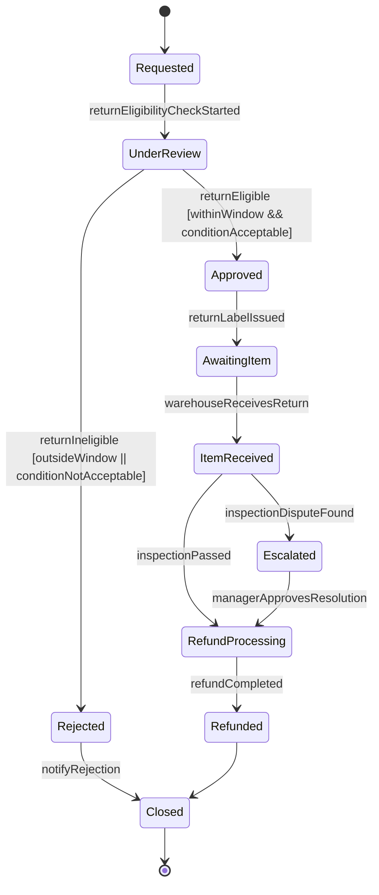
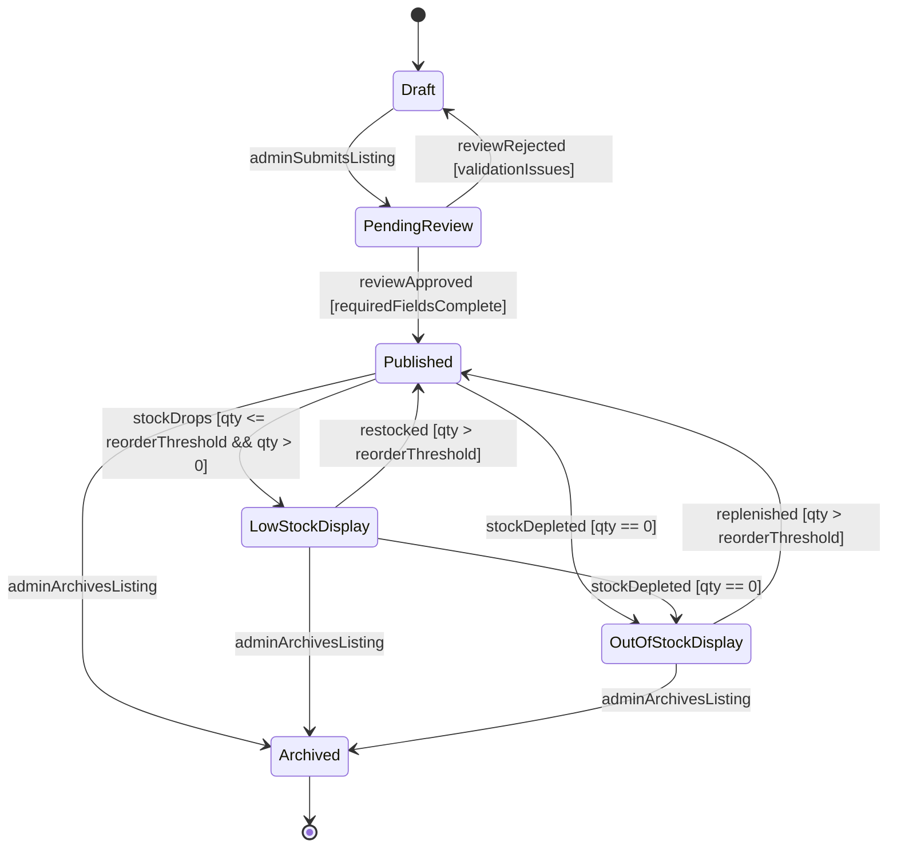

# Assignment 8 - UML State Transition Diagrams (Mermaid)

This document models the lifecycle of **8 critical MangaBookStore objects**.  
Each section includes a Mermaid state transition diagram and a brief mapping to Assignment 4 functional requirements and Assignment 6 user stories/sprint work.

---

## 1) User Account

**Explanation:** Captures onboarding, activation, security lockout, and admin moderation transitions.  
**Traceability:** FR-1, FR-2, FR-15; US-001, US-002, US-015.

---

## 2) Book Inventory Item

**Explanation:** Shows real-time stock behavior tied to checkout reservations and admin inventory controls.  
**Traceability:** FR-7, FR-11, FR-12, FR-13, FR-14; US-007, US-011, US-012, US-013, US-014.

---

## 3) Shopping Cart

**Explanation:** Models cart persistence, validation guards, and conversion to order.  
**Traceability:** FR-7, FR-8, FR-9; US-007, US-008, US-009.

---

## 4) Order

**Explanation:** Covers full order execution including cancellation and refund consequences.  
**Traceability:** FR-9, FR-10, FR-14; US-009, US-010, US-014.

---

## 5) Payment Transaction

**Explanation:** Represents payment gateway outcomes, settlement, and refund branches.  
**Traceability:** FR-9, FR-14; US-009, US-014.

---

## 6) Shipment

**Explanation:** Models shipping progression and exception/return handling.  
**Traceability:** FR-10, FR-14; US-010, US-014.

---

## 7) Return/Refund Request

**Explanation:** Defines return request review, inspection, and refund completion lifecycle.  
**Traceability:** FR-10, FR-14; US-010, US-014.

---

## 8) Manga Listing

**Explanation:** Shows catalog publication and stock-aware visibility states used by browse/search workflows.  
**Traceability:** FR-3, FR-4, FR-5, FR-11, FR-12, FR-13; US-003, US-004, US-005, US-011, US-012, US-013.
