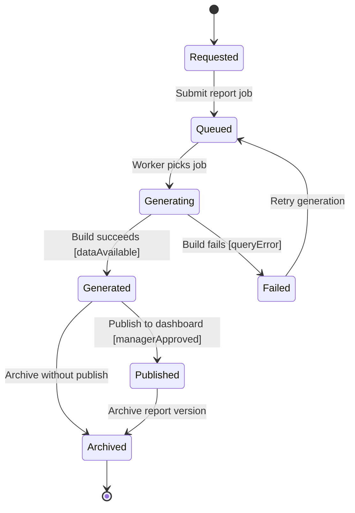

# Admin Report State Diagram

## Explanation
- **Key states/transitions:** Reporting moves through queueing, generation, quality gate, and publication/archival.
- **Use case mapping:** Generate Sales Reports, View Inventory Levels.
- **Placeholder traceability:** FR-121 (generate reports), FR-122 (publish report outputs); US-108; ST-108.
