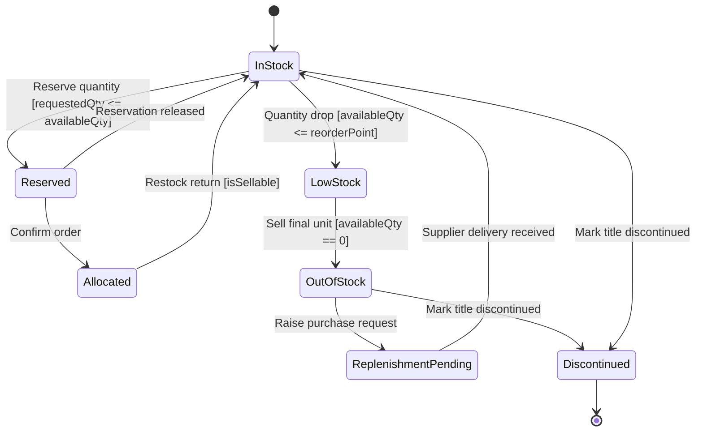

# Inventory Item State Diagram

## Explanation
- **Key states/transitions:** Reservation/allocation and replenishment states maintain stock integrity during checkout and admin updates.
- **Use case mapping:** Validate Stock Availability, Update Inventory, View Inventory Levels, Add Items to Shopping Cart.
- **Placeholder traceability:** FR-118 (reserve inventory), FR-119 (replenish stock), FR-120 (discontinue item); US-107; ST-107.
