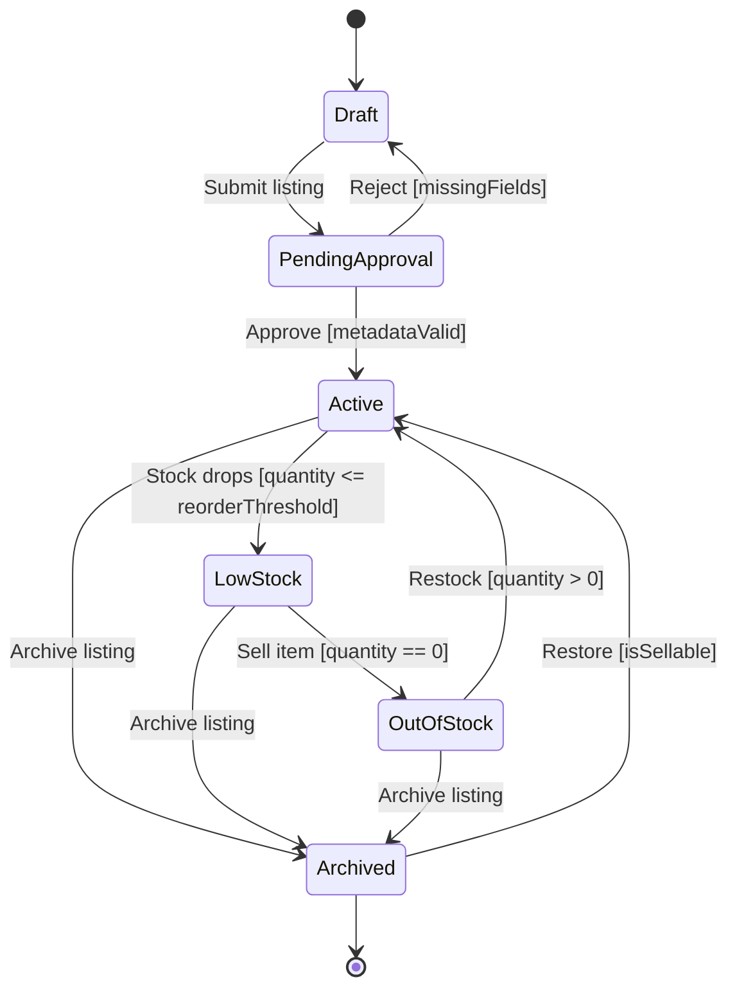

# Manga Listing State Diagram

## Explanation
- **Key states/transitions:** Listing moves from `Draft` to `PendingApproval` and becomes `Active` only when validation passes; stock-driven states (`LowStock`, `OutOfStock`) support availability behavior.
- **Use case mapping:** Add New Manga Title, Update Manga Information, Remove Manga Listing, Browse Manga Catalog, View Manga Details.
- **Placeholder traceability:** FR-101 (manage listings), FR-102 (publish validated metadata), FR-103 (reflect stock visibility); US-101; ST-101.
