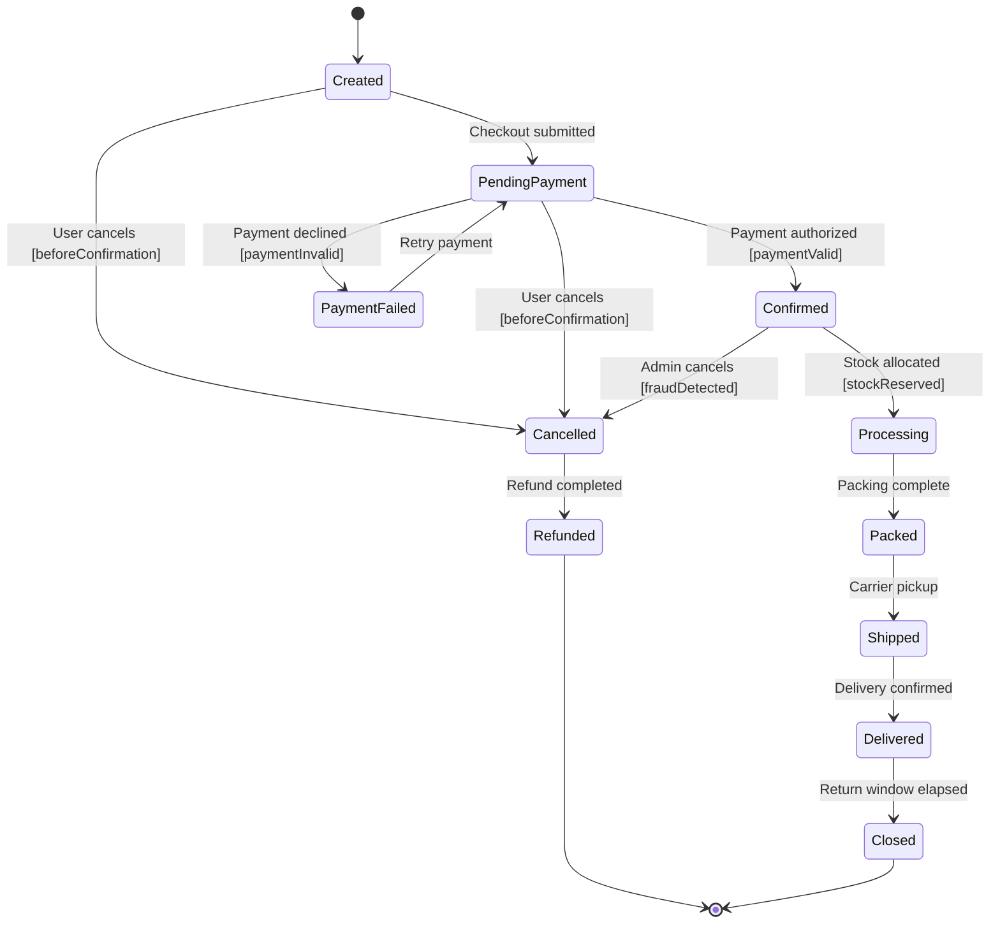

# Order State Diagram

## Explanation
- **Key states/transitions:** Payment and fulfillment states are separated to represent checkout risk and operational flow.
- **Use case mapping:** Checkout Process, Place Order, Track Order Status, View All Customer Orders, Update Order Status.
- **Placeholder traceability:** FR-110 (create order), FR-111 (track order), FR-112 (cancel/refund order); US-104; ST-104.
