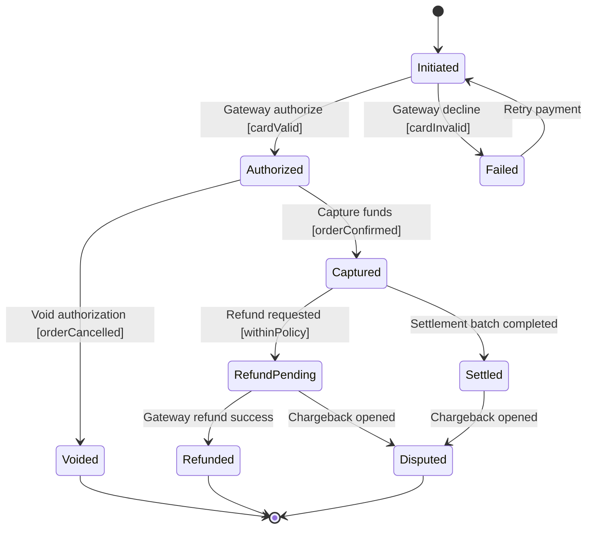

# Payment State Diagram

## Explanation
- **Key states/transitions:** Authorization, capture, settlement, and refund/chargeback states model payment risk and finality.
- **Use case mapping:** Process Payment, Checkout Process, Place Order.
- **Placeholder traceability:** FR-113 (authorize payment), FR-114 (capture/settle), FR-115 (refund handling); US-105; ST-105.
