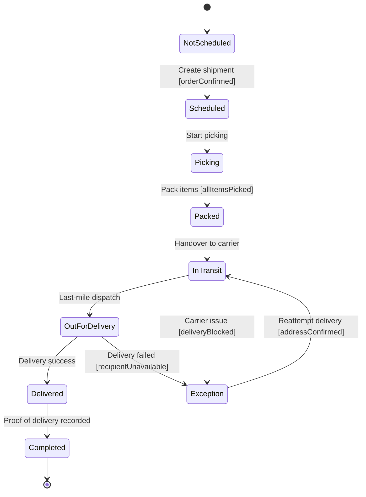

# Shipment Fulfillment State Diagram

## Explanation
- **Key states/transitions:** Fulfillment transitions from scheduling through carrier events, with guarded exception recovery.
- **Use case mapping:** Track Order Status, Update Order Status, View All Customer Orders.
- **Placeholder traceability:** FR-116 (fulfillment tracking), FR-117 (delivery exception handling); US-106; ST-106.
