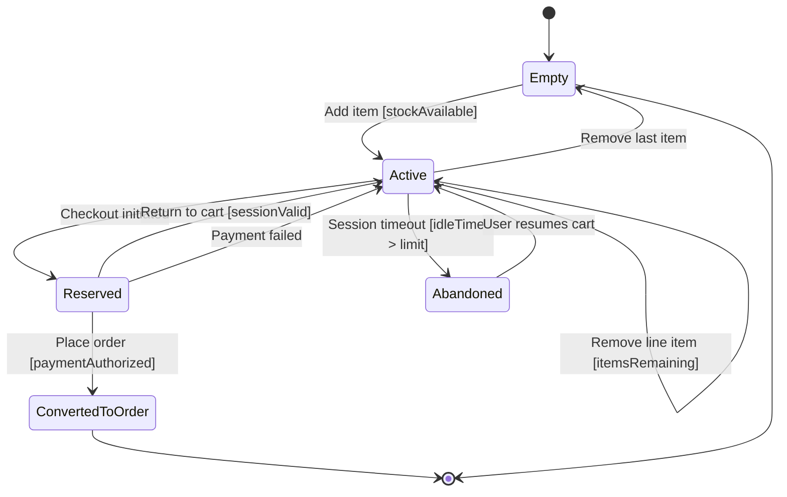

# Shopping Cart State Diagram

## Explanation
- **Key states/transitions:** Cart lifecycle supports add/modify/remove flows, reservation during checkout, and abandonment/resume behavior.
- **Use case mapping:** Add Items to Shopping Cart, Modify Cart Quantity, Remove Items from Cart, Checkout Process, Place Order.
- **Placeholder traceability:** FR-107 (cart operations), FR-108 (cart reservation), FR-109 (recover abandoned carts); US-103; ST-103.
