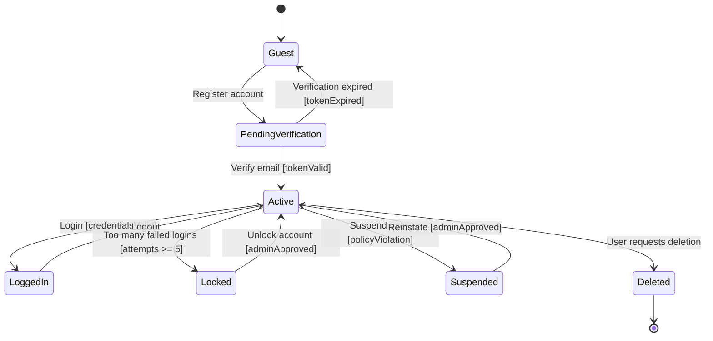

# User Account State Diagram

## Explanation
- **Key states/transitions:** Registration and verification control entry into `Active`; security events move accounts to `Locked` or `Suspended` with guarded recovery.
- **Use case mapping:** Register Account, Login/Authentication, Manage User Accounts, Manage User Profile.
- **Placeholder traceability:** FR-104 (register user), FR-105 (authenticate user), FR-106 (account administration); US-102; ST-102.
