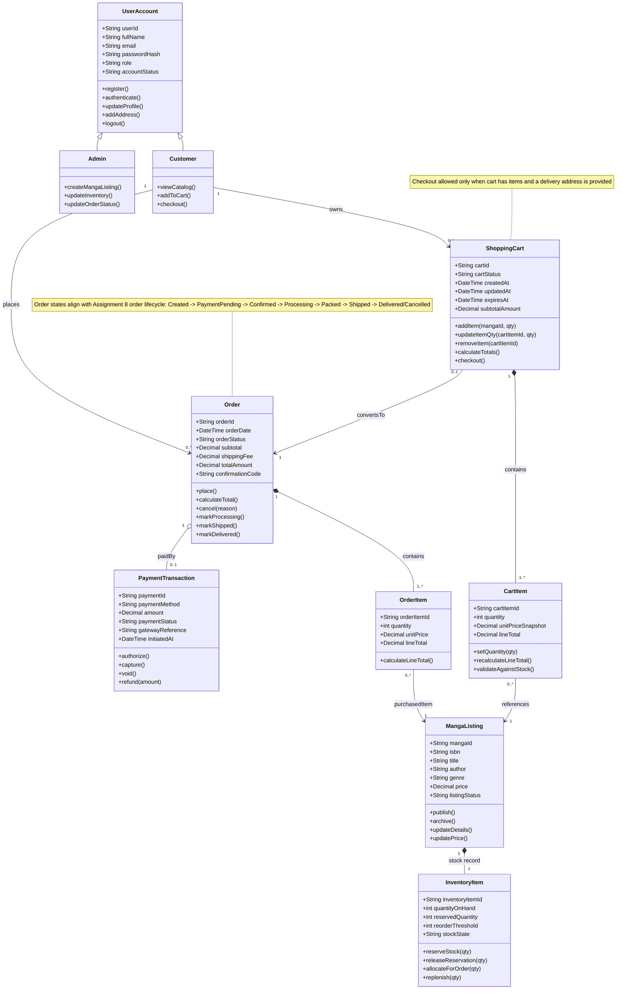

# Assignment 9: Class Diagram (Mermaid.js)

## Mermaid Class Diagram

## Key Design Decisions

- **Inheritance for roles:** `Customer` and `Admin` inherit from `UserAccount` to share identity/security fields while separating role-specific behaviors.
- **Composition for lifecycle ownership:** `ShoppingCart` composes `CartItem`, and `Order` composes `OrderItem` because child records should not exist independently.
- **Composition for stock model:** `InventoryItem` is composition-bound to `MangaListing` in this simplified design to represent one stock record per SKU.
- **Association with multiplicity:** Multiplicity clarifies business constraints (for example, one customer can place many orders, while each order has at most one primary payment transaction).
- **State-model alignment:** Order and payment operations are intentionally consistent with Assignment 8 state diagrams (authorization before capture, constrained transitions).
