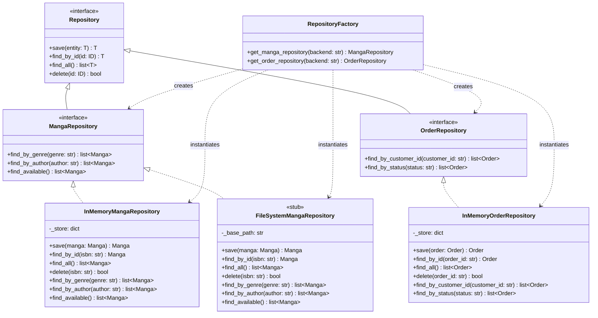

# Assignment 11: Repository Layer Class Diagram

This diagram shows the repository interfaces, in-memory implementations, factory, and stub backend for the MangaBookStore system.

```mermaid
classDiagram

    class Repository {
        <<interface>>
        +save(entity: T) T
        +find_by_id(id: ID) T
        +find_all() list~T~
        +delete(id: ID) bool
    }

    class MangaRepository {
        <<interface>>
        +find_by_genre(genre: str) list~Manga~
        +find_by_author(author: str) list~Manga~
        +find_available() list~Manga~
    }

    class OrderRepository {
        <<interface>>
        +find_by_customer_id(customer_id: str) list~Order~
        +find_by_status(status: str) list~Order~
    }

    class InMemoryMangaRepository {
        -_store: dict
        +save(manga: Manga) Manga
        +find_by_id(isbn: str) Manga
        +find_all() list~Manga~
        +delete(isbn: str) bool
        +find_by_genre(genre: str) list~Manga~
        +find_by_author(author: str) list~Manga~
        +find_available() list~Manga~
    }

    class InMemoryOrderRepository {
        -_store: dict
        +save(order: Order) Order
        +find_by_id(order_id: str) Order
        +find_all() list~Order~
        +delete(order_id: str) bool
        +find_by_customer_id(customer_id: str) list~Order~
        +find_by_status(status: str) list~Order~
    }

    class FileSystemMangaRepository {
        <<stub>>
        -_base_path: str
        +save(manga: Manga) Manga
        +find_by_id(isbn: str) Manga
        +find_all() list~Manga~
        +delete(isbn: str) bool
        +find_by_genre(genre: str) list~Manga~
        +find_by_author(author: str) list~Manga~
        +find_available() list~Manga~
    }

    class RepositoryFactory {
        +get_manga_repository(backend: str) MangaRepository
        +get_order_repository(backend: str) OrderRepository
    }

    Repository <|-- MangaRepository
    Repository <|-- OrderRepository
    MangaRepository <|.. InMemoryMangaRepository
    OrderRepository <|.. InMemoryOrderRepository
    MangaRepository <|.. FileSystemMangaRepository
    RepositoryFactory ..> MangaRepository : creates
    RepositoryFactory ..> OrderRepository : creates
    RepositoryFactory ..> InMemoryMangaRepository : instantiates
    RepositoryFactory ..> InMemoryOrderRepository : instantiates
    RepositoryFactory ..> FileSystemMangaRepository : instantiates
```

