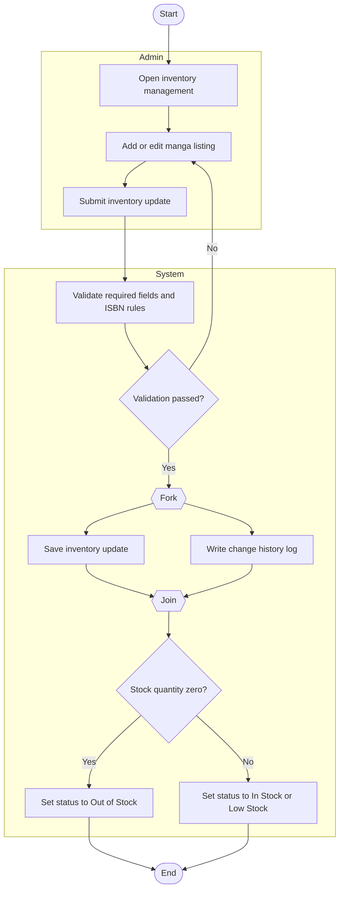

# Admin Inventory Update Activity Diagram

```mermaid
flowchart TD
    Start([Start]) --> A1

    subgraph Admin
      A1[Open inventory management]
      A2[Add or edit manga listing]
      A3[Submit inventory update]
    end

    subgraph System
      S1[Validate required fields and ISBN rules]
      D1{Validation passed?}
      F1{{Fork}}
      S2[Save inventory update]
      S3[Write change history log]
      J1{{Join}}
      D2{Stock quantity zero?}
      S4[Set status to Out of Stock]
      S5[Set status to In Stock or Low Stock]
    end

    A1 --> A2 --> A3 --> S1 --> D1
    D1 -- No --> A2
    D1 -- Yes --> F1
    F1 --> S2
    F1 --> S3
    S2 --> J1
    S3 --> J1
    J1 --> D2
    D2 -- Yes --> S4 --> End([End])
    D2 -- No --> S5 --> End
```
