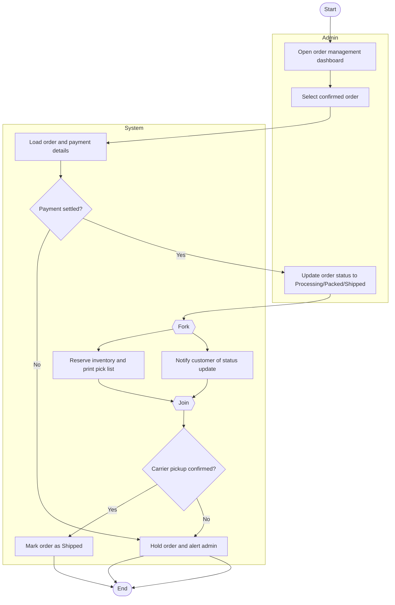

# Admin Order Fulfillment Activity Diagram

```mermaid
flowchart TD
    Start([Start]) --> A1

    subgraph Admin
      A1[Open order management dashboard]
      A2[Select confirmed order]
      A3[Update order status to Processing/Packed/Shipped]
    end

    subgraph System
      S1[Load order and payment details]
      D1{Payment settled?}
      F1{{Fork}}
      S2[Reserve inventory and print pick list]
      S3[Notify customer of status update]
      J1{{Join}}
      D2{Carrier pickup confirmed?}
      S4[Mark order as Shipped]
      S5[Hold order and alert admin]
    end

    A1 --> A2 --> S1 --> D1
    D1 -- No --> S5 --> End([End])
    D1 -- Yes --> A3 --> F1
    F1 --> S2
    F1 --> S3
    S2 --> J1
    S3 --> J1
    J1 --> D2
    D2 -- Yes --> S4 --> End
    D2 -- No --> S5 --> End
```
