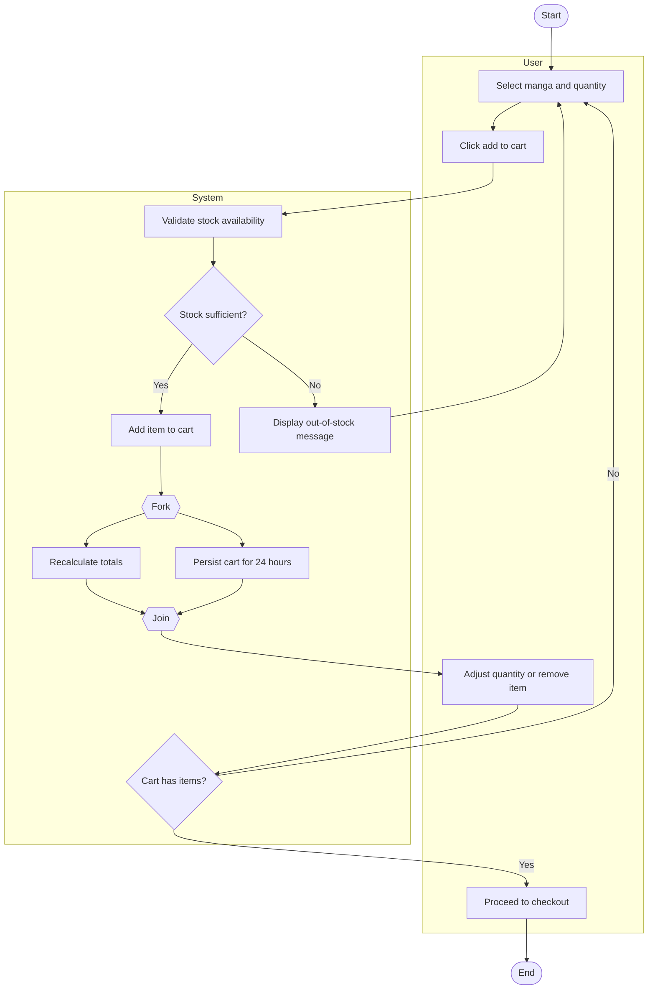

# Cart Management Activity Diagram

```mermaid
flowchart TD
    Start([Start]) --> U1

    subgraph User
      U1[Select manga and quantity]
      U2[Click add to cart]
      U3[Adjust quantity or remove item]
      U4[Proceed to checkout]
    end

    subgraph System
      S1[Validate stock availability]
      D1{Stock sufficient?}
      S2[Add item to cart]
      F1{{Fork}}
      S3[Recalculate totals]
      S4[Persist cart for 24 hours]
      J1{{Join}}
      D2{Cart has items?}
      S5[Display out-of-stock message]
    end

    U1 --> U2 --> S1 --> D1
    D1 -- No --> S5 --> U1
    D1 -- Yes --> S2 --> F1
    F1 --> S3
    F1 --> S4
    S3 --> J1
    S4 --> J1
    J1 --> U3 --> D2
    D2 -- No --> U1
    D2 -- Yes --> U4 --> End([End])
```
