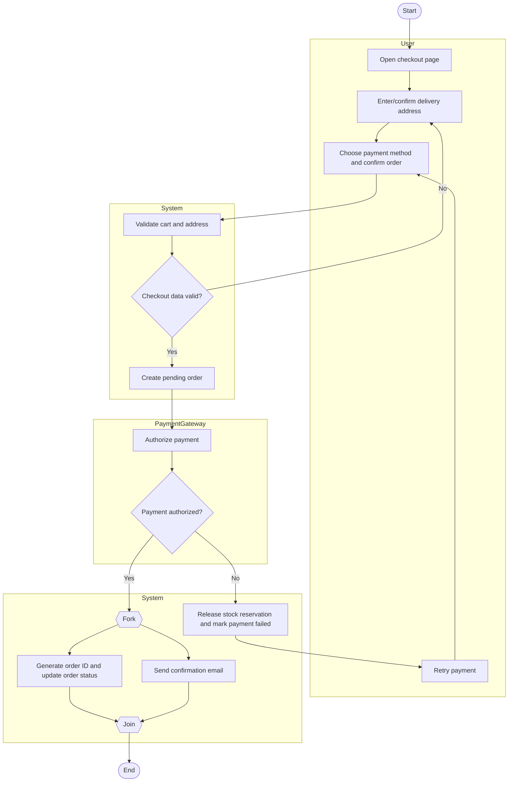

# Checkout and Payment Activity Diagram

```mermaid
flowchart TD
    Start([Start]) --> U1

    subgraph User
      U1[Open checkout page]
      U2[Enter/confirm delivery address]
      U3[Choose payment method and confirm order]
      U4[Retry payment]
    end

    subgraph System
      S1[Validate cart and address]
      D1{Checkout data valid?}
      S2[Create pending order]
    end

    subgraph PaymentGateway
      P1[Authorize payment]
      D2{Payment authorized?}
    end

    subgraph System_2[System]
      F1{{Fork}}
      S3[Generate order ID and update order status]
      S4[Send confirmation email]
      J1{{Join}}
      S5[Release stock reservation and mark payment failed]
    end

    U1 --> U2 --> U3 --> S1 --> D1
    D1 -- No --> U2
    D1 -- Yes --> S2 --> P1 --> D2
    D2 -- No --> S5 --> U4 --> U3
    D2 -- Yes --> F1
    F1 --> S3
    F1 --> S4
    S3 --> J1
    S4 --> J1
    J1 --> End([End])
```
