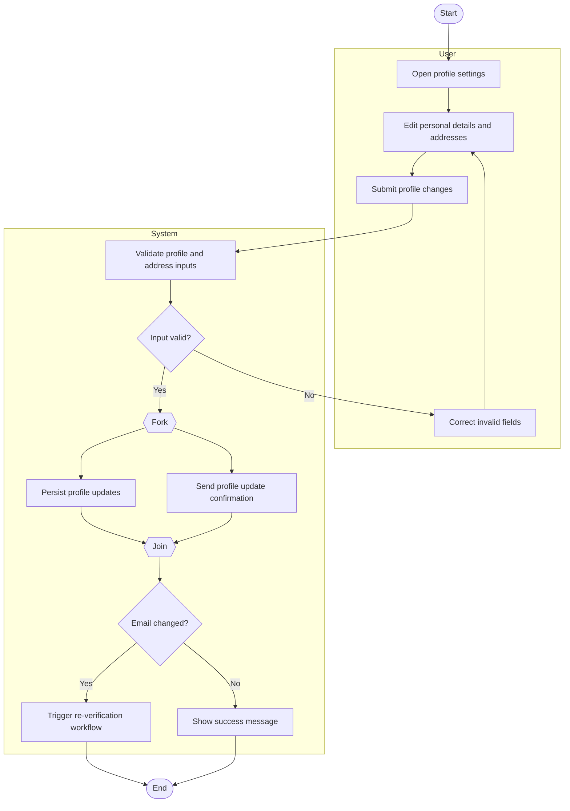

# Profile and Address Update Activity Diagram

```mermaid
flowchart TD
    Start([Start]) --> U1

    subgraph User
      U1[Open profile settings]
      U2[Edit personal details and addresses]
      U3[Submit profile changes]
      U4[Correct invalid fields]
    end

    subgraph System
      S1[Validate profile and address inputs]
      D1{Input valid?}
      F1{{Fork}}
      S2[Persist profile updates]
      S3[Send profile update confirmation]
      J1{{Join}}
      D2{Email changed?}
      S4[Trigger re-verification workflow]
      S5[Show success message]
    end

    U1 --> U2 --> U3 --> S1 --> D1
    D1 -- No --> U4 --> U2
    D1 -- Yes --> F1
    F1 --> S2
    F1 --> S3
    S2 --> J1
    S3 --> J1
    J1 --> D2
    D2 -- Yes --> S4 --> End([End])
    D2 -- No --> S5 --> End
```
