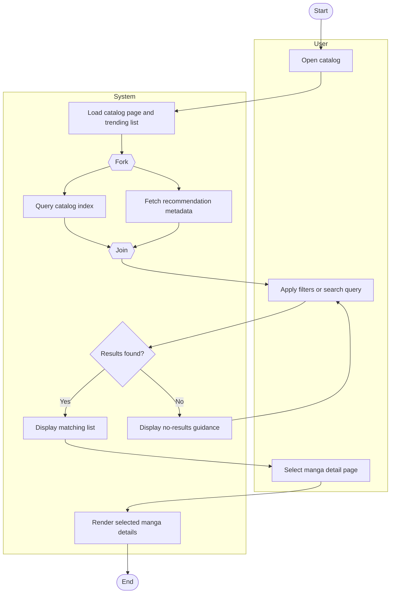

# Search and Browse Manga Activity Diagram

```mermaid
flowchart TD
    Start([Start]) --> U1

    subgraph User
      U1[Open catalog]
      U2[Apply filters or search query]
      U3[Select manga detail page]
    end

    subgraph System
      S1[Load catalog page and trending list]
      F1{{Fork}}
      S2[Query catalog index]
      S3[Fetch recommendation metadata]
      J1{{Join}}
      D1{Results found?}
      S4[Display matching list]
      S5[Display no-results guidance]
      S6[Render selected manga details]
    end

    U1 --> S1 --> F1
    F1 --> S2
    F1 --> S3
    S2 --> J1
    S3 --> J1
    J1 --> U2 --> D1
    D1 -- Yes --> S4 --> U3 --> S6 --> End([End])
    D1 -- No --> S5 --> U2
```
