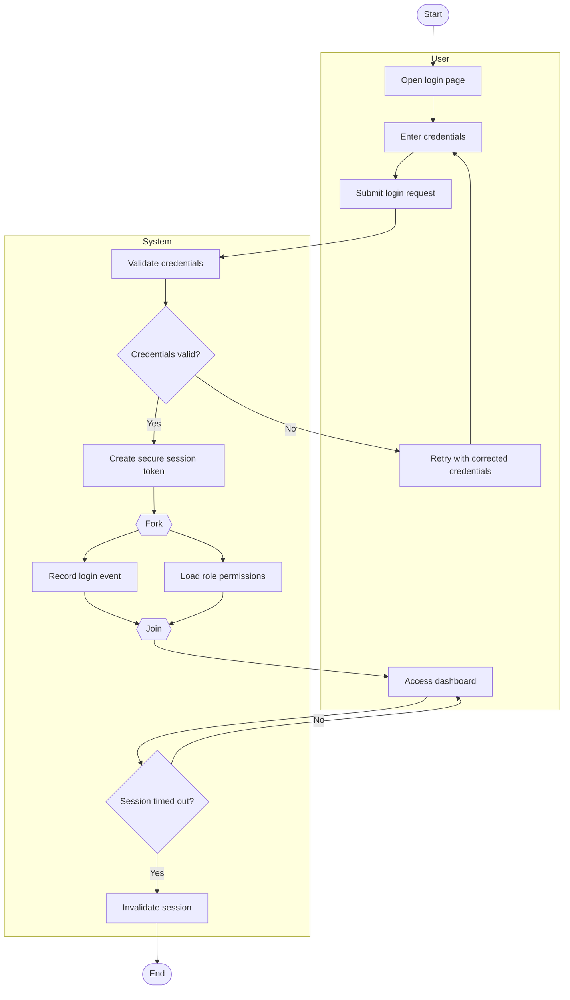

# User Login Activity Diagram

```mermaid
flowchart TD
    Start([Start]) --> U1

    subgraph User
      U1[Open login page]
      U2[Enter credentials]
      U3[Submit login request]
      U4[Retry with corrected credentials]
      U5[Access dashboard]
    end

    subgraph System
      S1[Validate credentials]
      D1{Credentials valid?}
      S2[Create secure session token]
      F1{{Fork}}
      S3[Record login event]
      S4[Load role permissions]
      J1{{Join}}
      D2{Session timed out?}
      S5[Invalidate session]
    end

    U1 --> U2 --> U3 --> S1 --> D1
    D1 -- No --> U4 --> U2
    D1 -- Yes --> S2 --> F1
    F1 --> S3
    F1 --> S4
    S3 --> J1
    S4 --> J1
    J1 --> U5 --> D2
    D2 -- No --> U5
    D2 -- Yes --> S5 --> End([End])
```
