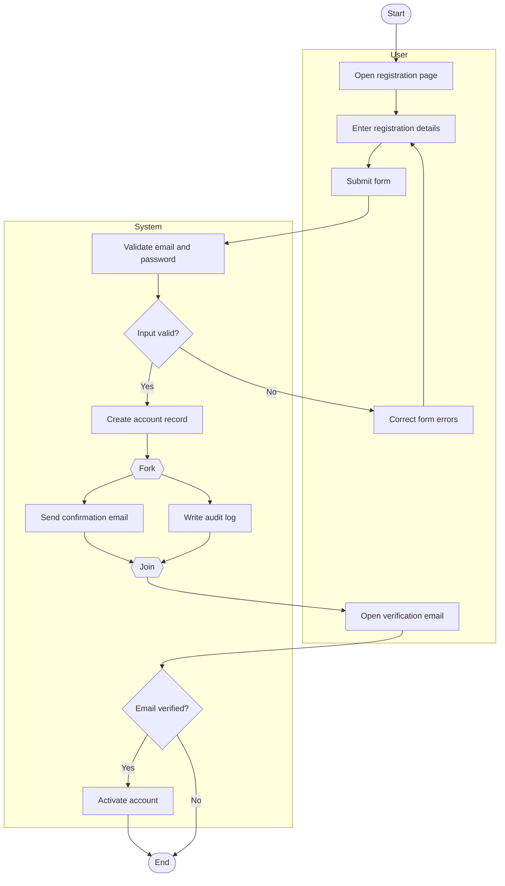

# User Registration Activity Diagram

```mermaid
flowchart TD
    Start([Start]) --> U1

    subgraph User
      U1[Open registration page]
      U2[Enter registration details]
      U3[Submit form]
      U4[Correct form errors]
      U5[Open verification email]
    end

    subgraph System
      S1[Validate email and password]
      D1{Input valid?}
      S2[Create account record]
      F1{{Fork}}
      S3[Send confirmation email]
      S4[Write audit log]
      J1{{Join}}
      D2{Email verified?}
      S5[Activate account]
    end

    U1 --> U2 --> U3 --> S1 --> D1
    D1 -- No --> U4 --> U2
    D1 -- Yes --> S2 --> F1
    F1 --> S3
    F1 --> S4
    S3 --> J1
    S4 --> J1
    J1 --> U5 --> D2
    D2 -- Yes --> S5 --> End([End])
    D2 -- No --> End
```
