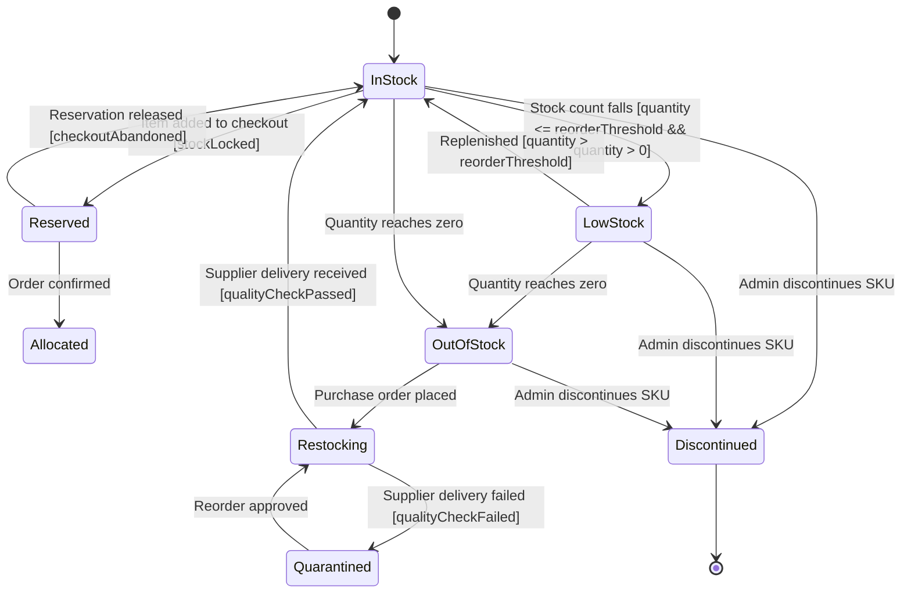

# Inventory Item State Diagram

```mermaid
stateDiagram-v2
    [*] --> InStock
    InStock --> Reserved: Item added to checkout [stockLocked]
    Reserved --> InStock: Reservation released [checkoutAbandoned]
    Reserved --> Allocated: Order confirmed

    InStock --> LowStock: Stock count falls [quantity <= reorderThreshold && quantity > 0]
    LowStock --> InStock: Replenished [quantity > reorderThreshold]
    LowStock --> OutOfStock: Quantity reaches zero
    InStock --> OutOfStock: Quantity reaches zero

    OutOfStock --> Restocking: Purchase order placed
    Restocking --> InStock: Supplier delivery received [qualityCheckPassed]
    Restocking --> Quarantined: Supplier delivery failed [qualityCheckFailed]
    Quarantined --> Restocking: Reorder approved

    InStock --> Discontinued: Admin discontinues SKU
    LowStock --> Discontinued: Admin discontinues SKU
    OutOfStock --> Discontinued: Admin discontinues SKU
    Discontinued --> [*]
```
