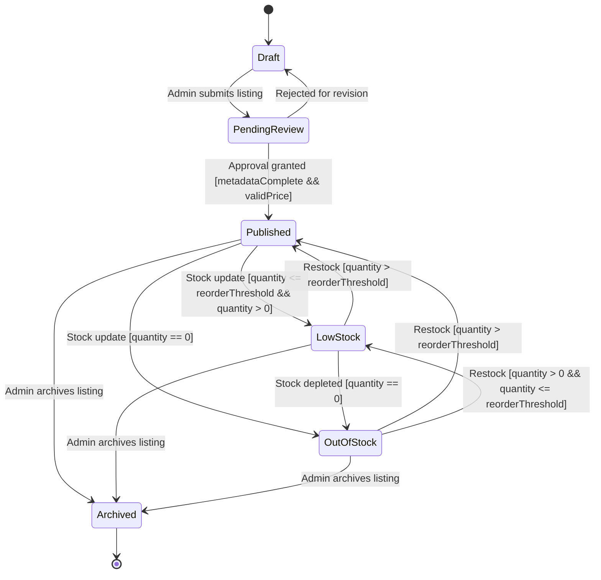

# Manga Listing State Diagram

```mermaid
stateDiagram-v2
    [*] --> Draft
    Draft --> PendingReview: Admin submits listing
    PendingReview --> Published: Approval granted [metadataComplete && validPrice]
    PendingReview --> Draft: Rejected for revision

    Published --> LowStock: Stock update [quantity <= reorderThreshold && quantity > 0]
    Published --> OutOfStock: Stock update [quantity == 0]

    LowStock --> Published: Restock [quantity > reorderThreshold]
    LowStock --> OutOfStock: Stock depleted [quantity == 0]

    OutOfStock --> Published: Restock [quantity > reorderThreshold]
    OutOfStock --> LowStock: Restock [quantity > 0 && quantity <= reorderThreshold]

    Published --> Archived: Admin archives listing
    LowStock --> Archived: Admin archives listing
    OutOfStock --> Archived: Admin archives listing
    Archived --> [*]
```
