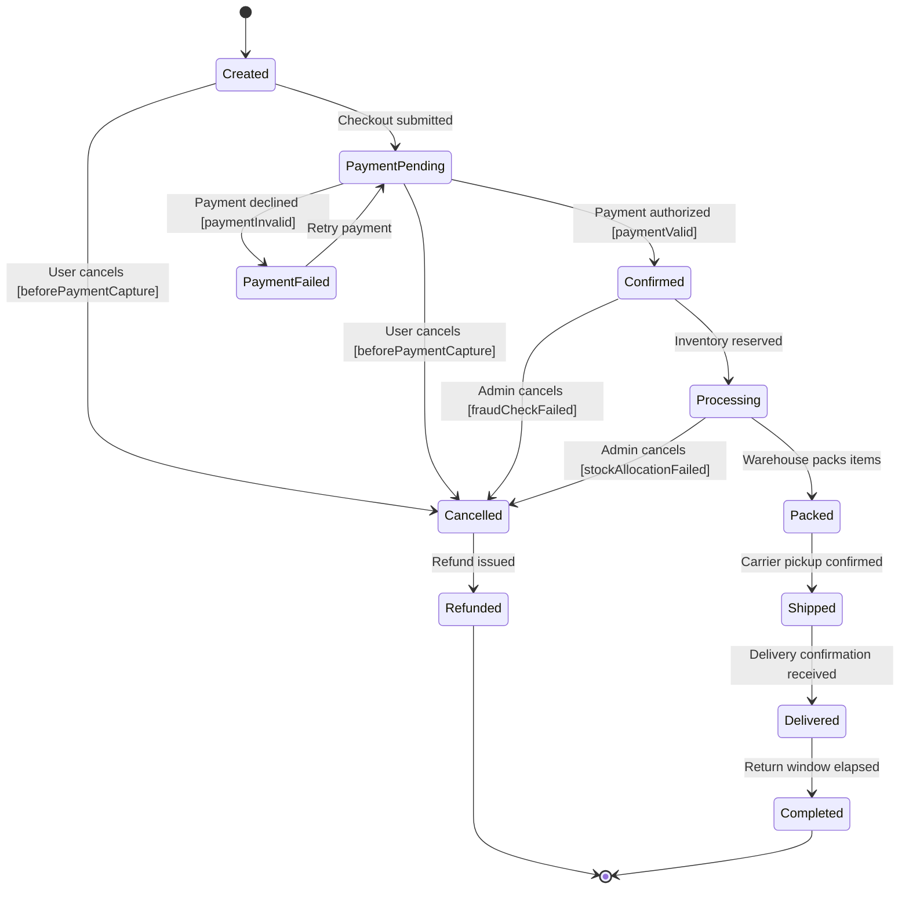

# Order State Diagram

```mermaid
stateDiagram-v2
    [*] --> Created
    Created --> PaymentPending: Checkout submitted
    PaymentPending --> Confirmed: Payment authorized [paymentValid]
    PaymentPending --> PaymentFailed: Payment declined [paymentInvalid]
    PaymentFailed --> PaymentPending: Retry payment

    Confirmed --> Processing: Inventory reserved
    Processing --> Packed: Warehouse packs items
    Packed --> Shipped: Carrier pickup confirmed
    Shipped --> Delivered: Delivery confirmation received

    Created --> Cancelled: User cancels [beforePaymentCapture]
    PaymentPending --> Cancelled: User cancels [beforePaymentCapture]
    Confirmed --> Cancelled: Admin cancels [fraudCheckFailed]
    Processing --> Cancelled: Admin cancels [stockAllocationFailed]

    Delivered --> Completed: Return window elapsed
    Cancelled --> Refunded: Refund issued
    Refunded --> [*]
    Completed --> [*]
```
