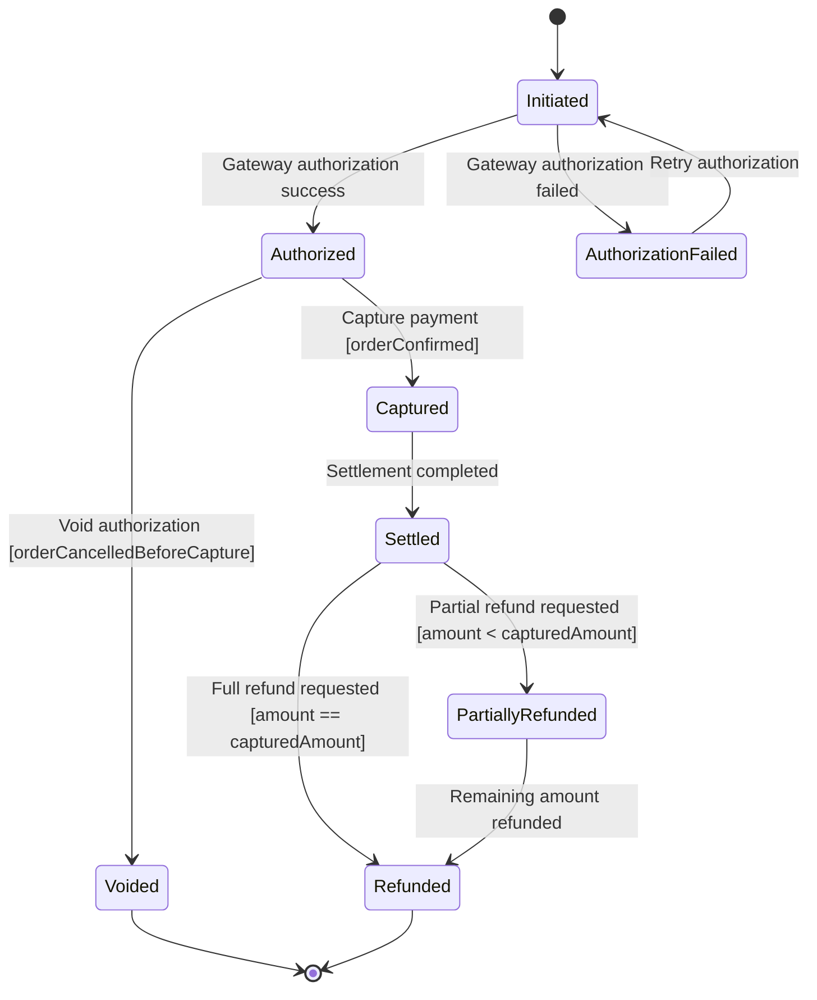

# Payment Transaction State Diagram

```mermaid
stateDiagram-v2
    [*] --> Initiated
    Initiated --> Authorized: Gateway authorization success
    Initiated --> AuthorizationFailed: Gateway authorization failed
    AuthorizationFailed --> Initiated: Retry authorization

    Authorized --> Captured: Capture payment [orderConfirmed]
    Authorized --> Voided: Void authorization [orderCancelledBeforeCapture]

    Captured --> Settled: Settlement completed
    Settled --> PartiallyRefunded: Partial refund requested [amount < capturedAmount]
    Settled --> Refunded: Full refund requested [amount == capturedAmount]
    PartiallyRefunded --> Refunded: Remaining amount refunded

    Voided --> [*]
    Refunded --> [*]
```
