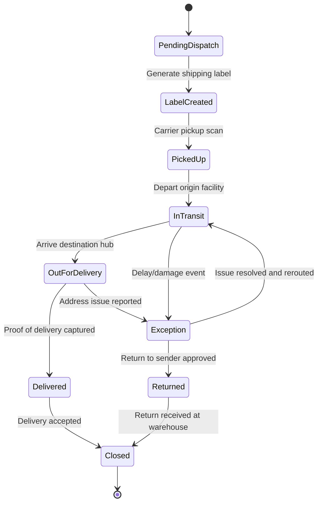

# Shipment State Diagram

```mermaid
stateDiagram-v2
    [*] --> PendingDispatch
    PendingDispatch --> LabelCreated: Generate shipping label
    LabelCreated --> PickedUp: Carrier pickup scan
    PickedUp --> InTransit: Depart origin facility
    InTransit --> OutForDelivery: Arrive destination hub
    OutForDelivery --> Delivered: Proof of delivery captured

    InTransit --> Exception: Delay/damage event
    OutForDelivery --> Exception: Address issue reported
    Exception --> InTransit: Issue resolved and rerouted
    Exception --> Returned: Return to sender approved

    Delivered --> Closed: Delivery accepted
    Returned --> Closed: Return received at warehouse
    Closed --> [*]
```
