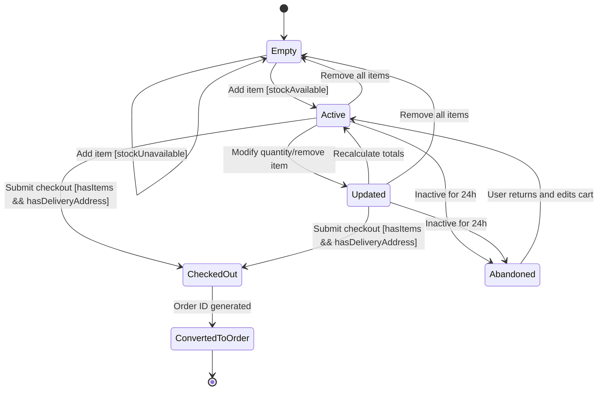

# Shopping Cart State Diagram

```mermaid
stateDiagram-v2
    [*] --> Empty
    Empty --> Active: Add item [stockAvailable]
    Empty --> Empty: Add item [stockUnavailable]

    Active --> Updated: Modify quantity/remove item
    Updated --> Active: Recalculate totals

    Active --> CheckedOut: Submit checkout [hasItems && hasDeliveryAddress]
    Updated --> CheckedOut: Submit checkout [hasItems && hasDeliveryAddress]

    Active --> Abandoned: Inactive for 24h
    Updated --> Abandoned: Inactive for 24h
    Abandoned --> Active: User returns and edits cart

    Active --> Empty: Remove all items
    Updated --> Empty: Remove all items
    CheckedOut --> ConvertedToOrder: Order ID generated
    ConvertedToOrder --> [*]
```
