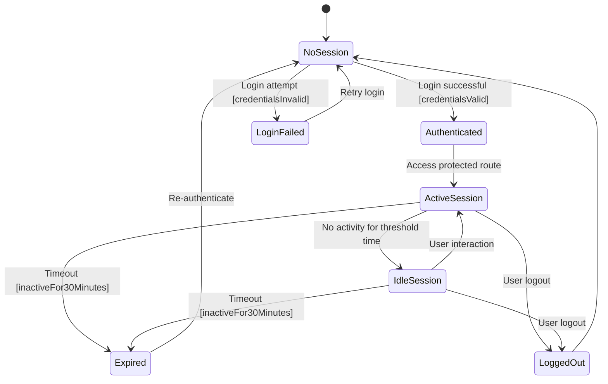

# User Session State Diagram

```mermaid
stateDiagram-v2
    [*] --> NoSession
    NoSession --> Authenticated: Login successful [credentialsValid]
    NoSession --> LoginFailed: Login attempt [credentialsInvalid]
    LoginFailed --> NoSession: Retry login

    Authenticated --> ActiveSession: Access protected route
    ActiveSession --> IdleSession: No activity for threshold time
    IdleSession --> ActiveSession: User interaction

    ActiveSession --> Expired: Timeout [inactiveFor30Minutes]
    IdleSession --> Expired: Timeout [inactiveFor30Minutes]

    ActiveSession --> LoggedOut: User logout
    IdleSession --> LoggedOut: User logout
    Expired --> NoSession: Re-authenticate
    LoggedOut --> NoSession
```
