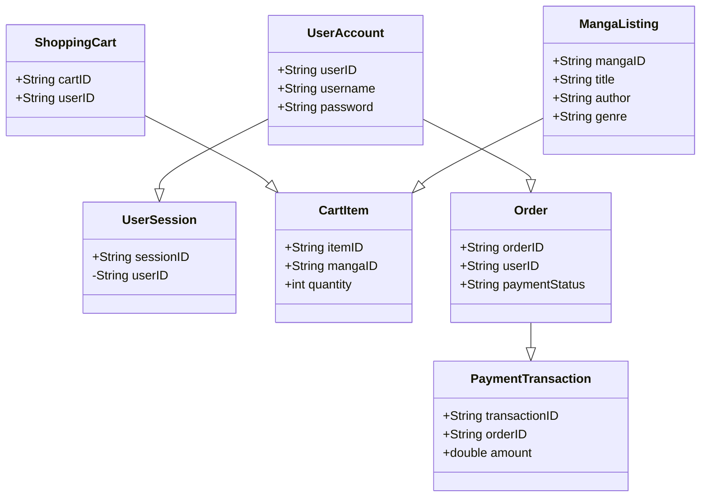

# Assignment 9 Deliverables

## Domain Model

| Entity                 | Attributes                         | Methods        | Relationships        |
|------------------------|------------------------------------|-----------------|----------------------|
| UserAccount            | userID, username, password        | create(), login | has many UserSessions |
| UserSession            | sessionID, userID                 | create()       | belongs to UserAccount |
| MangaListing           | mangaID, title, author, genre     | add(), remove() | has many CartItems   |
| ShoppingCart           | cartID, userID                    | checkout()     | has many CartItems   |
| CartItem              | itemID, mangaID, quantity         | add(), remove() | belongs to ShoppingCart |
| Order                  | orderID, userID, paymentStatus    | placeOrder()   | belongs to UserAccount |
| PaymentTransaction     | transactionID, orderID, amount    | processPayment()| belongs to Order      |

### Business Rules
- A user can have multiple sessions but one active session at a time.
- A shopping cart can contain multiple items.
- An order can only belong to one user.

## Class Diagram

